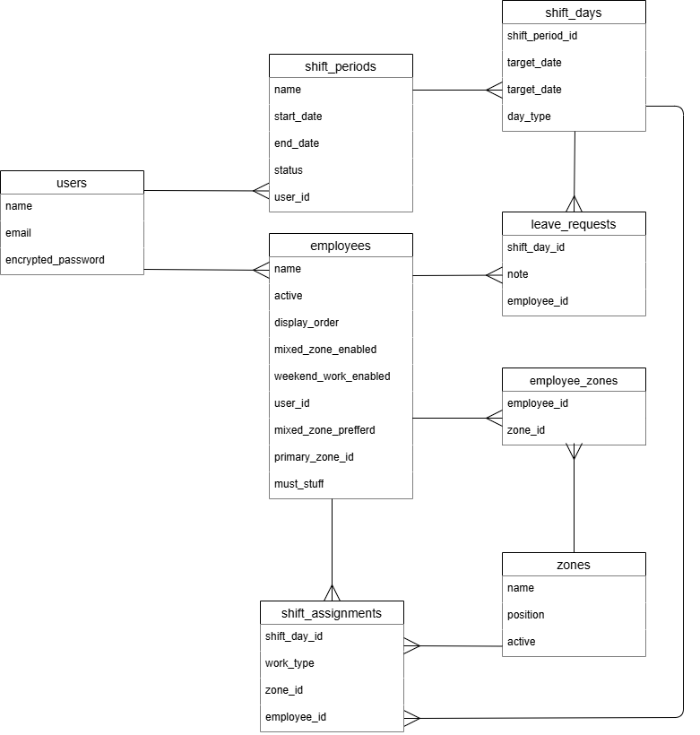
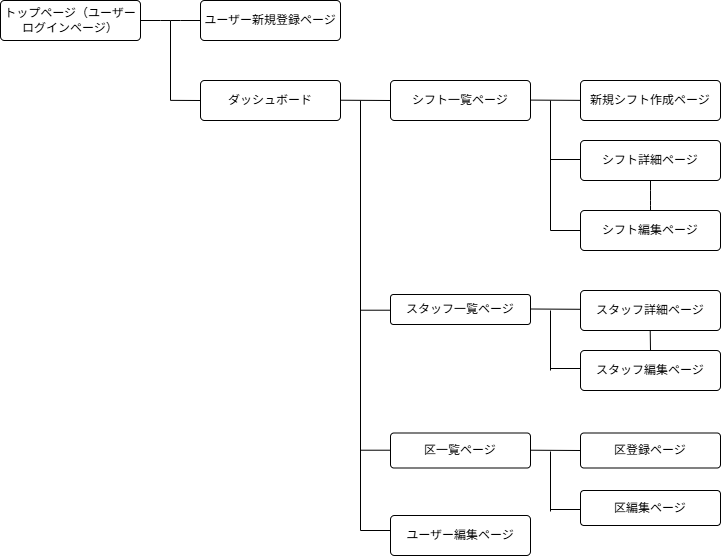

## アプリケーション名
Shift Generator

## アプリケーション概要

Shift Generatorは、スタッフ・担当区・希望休を管理しながら、対象期間のシフト表を作成できるシフト管理アプリケーションです。

主な機能は以下のとおりです。

- ユーザー登録・ログイン
- スタッフの登録、編集、削除
- 担当区の登録、並び順変更、有効・無効管理
- スタッフごとの担当可能区、メイン担当区、マスト要員、土日勤務可否、混合区（中勤）優先の設定
- シフト期間の作成、編集、削除、確定
- シフト表上での勤務割当、希望休登録、編集、削除
- 平日・土曜・日曜・祝日を判定したシフト日の自動作成
- 希望休や担当可能区を考慮したシフト自動生成
- 土日祝勤務者への代休割当
- マスト要員が未割当の日付を通知するアラート

## URL

https://shift-generator-46819.onrender.com/

## テスト用アカウント

- Basic認証ID: admin
- Basic認証Pass: 4681
- メールアドレス: test-ac@test.com
- t111111

## 利用方法

1. Basic認証を設定している場合は、Basic認証のIDとパスワードを入力します。
2. 新規登録画面からユーザー名、メールアドレス、パスワードを登録します。
3. ログイン後、区一覧画面で勤務場所や担当区を登録します。
4. スタッフ一覧画面でスタッフを登録し、担当可能区、メイン担当区、マスト要員、土日勤務可否、混合区(中勤優先)などを設定します。
5. シフト期間一覧画面から、シフトを作成したい期間を登録します。
6. シフト期間詳細画面の表から、スタッフごとの勤務や希望休を登録します。
7. 自動生成ボタンを押すと、希望休・担当可能区・土日勤務可否・マスト要員などを考慮して勤務が自動割当されます。
8. 必要に応じて手動で割当を修正し、シフト期間を確定します。

## アプリケーションを作成した背景

配達の現場では、担当できる区、土日祝の勤務可否、希望休、必ず配置したいスタッフなど、複数の条件を見ながらシフトを作成する必要があります。手作業での調整は時間がかかり、入力漏れや配置ミスも起こりやすくなります。

このアプリケーションは、シフト作成者がスタッフ情報と希望休を一元管理し、条件を考慮した自動生成によってシフト作成の負担を減らすことを目的に作成しました。

## 実装した機能についての画像やGIFおよびその説明

### トップページ・ログイン機能

[](https://gyazo.com/cb8278177745be4496c4c2ad91c4bb45)

Deviseを利用してユーザー登録・ログイン機能を実装しています。ログイン後は登録スタッフ数や主要な操作への導線を確認できます。

### スタッフ管理機能

[](https://gyazo.com/eddf250807e64dbcce1552f1051c4663)

スタッフ名、担当可能区、メイン担当区、マスト要員、土日勤務可否、混合区担当候補(中勤優先)などを登録できます。スタッフごとの条件をシフト自動生成に反映します。

### 区管理機能

[](https://gyazo.com/247c1cd0bc04594aba1c19cfd3931e39)

勤務区を登録し、表示順や有効状態を管理できます。スタッフの担当可能区や勤務割当の選択肢として利用します。

### シフト期間管理機能

[](https://gyazo.com/00eb0c9e3ce86902253aab2df9964493)

シフト名、開始日、終了日を登録すると、対象期間の日付データが自動作成されます。土曜・日曜・祝日は自動判定されます。

### シフト表編集機能

[](https://gyazo.com/7bc1efe407c602015cf13f5991bb29e5)

シフト表の各セルから勤務割当や希望休を登録できます。確定済みのシフト期間では編集・登録・削除ができないように制御しています。

### シフト自動生成機能

[](https://gyazo.com/d6ae6debb9fb3d2553574f9e16558b60)

希望休、担当可能区、土日勤務可否、混合区担当候補(中勤優先)、マスト要員などを考慮して勤務を自動生成します。土日祝勤務者には代休も自動で割り当てます。

### マスト要員アラート機能

[](https://gyazo.com/cf9f2bb3910a770990660582e2424998)

平日にマスト要員が未割当の場合、該当日を一覧表示します。希望休や手動変更により必須配置が外れた場合でも、作成者が気づけるようにしています。

## 実装予定の機能

- シフト表のCSV出力機能
- 曜日別・祝日・土日祝の必要人数の設定機能

## データベース設計



## 画面遷移図



## 開発環境

- フロントエンド
  - HTML
  - CSS
  - Javascript
- バックエンド
  - Ruby 3.2.0
  - Ruby on Rails 7.1
- インフラ
  - Render
- テスト
  - RSpec
- テキストエディタ
  - VSCode
- タスク管理
  - GitHub

## ローカルでの動作方法

以下のコマンドを順に実行してください。

```bash
git clone リポジトリURL
cd shift-generator
bundle install
rails db:create
rails db:migrate
```

## 工夫したポイント

- ログインユーザー(管理者)ごとにシフト期間・スタッフ情報を管理できるようにしました。
- シフト期間を作成すると、開始日から終了日までのシフト日を自動生成し、土曜・日曜・祝日を判定できるようにしました。
- 勤務割当と希望休が同じ日に重複しないよう、モデル側のバリデーションで整合性を保っています。
- 担当可能区以外の区にスタッフを割り当てられないようにし、シフト作成時の入力ミスを防いでいます。
- 土日祝勤務可否や中勤優先、マスト要員など、現場の調整で必要になりやすい条件をスタッフ情報として管理できるようにしました。
- シフト自動生成時には、希望休や既存割当を尊重しながら、勤務回数の偏りを抑えるようにしています。
- シフト確定後は編集・登録・削除を制限し、確定後の誤操作を防止しています。

## 改善点

- スタッフごとに月間勤務回数や土日勤務回数が集計表示されるようにする
- スマートフォンでのシフト表閲覧性を向上させる

## 制作時間

約60時間
